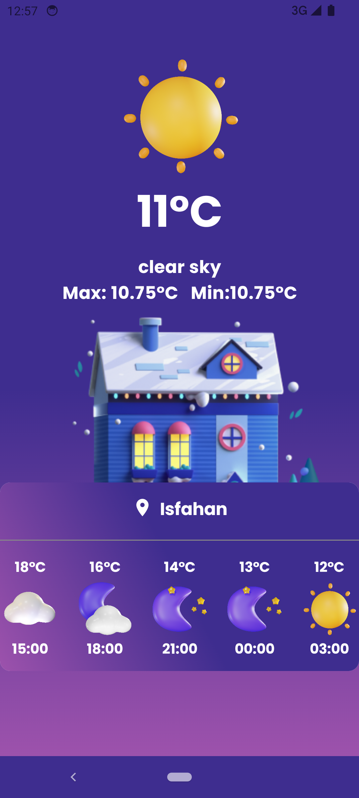

<h1 align="center"> WeatherForecast </h1>
<br>
<p align="center">
    
</p>
WeatherForecast is a modern Android weather application built using Jetpack Compose UI and adhering to a clear architecture pattern. Stay informed about the current weather conditions with an intuitive user interface and a robust, maintainable codebase.
<br>
<br>


## Screenshots 

<p align="center">
  
    
<br>
    
  

</p>


## Demo
[](https://drive.google.com/file/d/1To-Gqk-1fDHFHvZJPVV6t2jhqDbIjZVa/view?usp=drive_link)


[Show Demo Video](https://drive.google.com/file/d/1To-Gqk-1fDHFHvZJPVV6t2jhqDbIjZVa/view?usp=drive_link)

## Features
* Compose UI: Utilizes Jetpack Compose for building a declarative and reactive UI.
* Clear Architecture: Follows a clean architecture pattern for maintainability and scalability.
* Weather Data: Fetches real-time weather data from reliable sources to provide accurate information.
* Location Services: Uses location services to automatically determine and display local weather information.
* Customizable: Easily adaptable and customizable codebase for future enhancements and modifications.
  
## Tech Stack

* Clean Architecture(MVVM)
* Single Activity
* Jetpack Navigation Component
* Retrofit - Network Requests
* Hilt - Dependency Injection
* [OpenWeatherMap API](https://openweathermap.org/api)

## Getting Started
To get started with the WeatherApp, follow these steps:

1- Clone the repository:
```
   git clone https://github.com/your-username/WeatherApp-ComposeUI.git
```
2- Open the project in Android Studio.<br>
3- Get [Open Weather Map Api Key](https://openweathermap.org/api) and add to local.properties with "API_KEY" tag
```
   API_KEY="<INSERT_YOUR_API_KEY>"
```
4- Build and run the application on your emulator or device.

[](https://github.com/AtefehTaheri/WeatherForecast/releases)

or Get .APK : [Releases](https://github.com/AtefehTaheri/WeatherForecast/releases)
